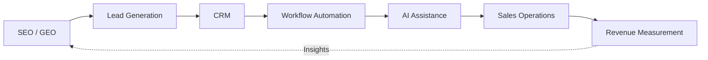

<div align="center">

# 👋 Prashant Rajput

### Founder | AI Automation · CRM Systems · SEO/GEO · System Integration

**Building practical AI, automation, search and revenue systems for businesses.**

Founder of **[Touchstone Infotech](https://www.touchstoneinfotech.com/)**, working at the intersection of **technology, marketing and revenue operations**.

I design and lead the implementation of connected systems that bring together:

**Search Visibility → Lead Generation → CRM → Automation → AI → Sales Operations → Revenue Measurement**

<br>

[](https://www.linkedin.com/in/prashant6788/)
[](https://www.touchstoneinfotech.com/)
[](https://github.com/prashant6788)

</div>

---

# 🚀 Featured Systems

My public repositories document practical frameworks for three connected layers of modern growth and revenue operations.

<table>
<tr>

<td width="33%" valign="top">

### 🔎 SEO Growth Systems

**Search visibility & discovery**

Frameworks for traditional SEO, technical SEO, GEO and visibility across AI-powered search and discovery platforms.

**[Explore Repository →](https://github.com/prashant6788/seo-growth-systems)**

**Start with:**

- [SEO Growth Framework](https://github.com/prashant6788/seo-growth-systems/blob/main/seo-growth-framework.md)
- [Technical SEO Audit Framework](https://github.com/prashant6788/seo-growth-systems/blob/main/technical-seo-audit-framework.md)
- [AI Search Visibility Checklist](https://github.com/prashant6788/seo-growth-systems/blob/main/ai-search-visibility-checklist.md)
- [GEO / LLM Visibility Framework](https://github.com/prashant6788/seo-growth-systems/blob/main/geo-llm-visibility-framework.md)

</td>

<td width="33%" valign="top">

### 🤖 AI Automation Playbooks

**Intelligence & workflow automation**

Frameworks for AI strategy, workflow design, AI-assisted operations, human handoff, QA and measurement.

**[Explore Repository →](https://github.com/prashant6788/ai-automation-playbooks)**

**Start with:**

- [AI Automation Readiness Checklist](https://github.com/prashant6788/ai-automation-playbooks/blob/main/ai-automation-readiness-checklist.md)
- [AI Automation Strategy Framework](https://github.com/prashant6788/ai-automation-playbooks/blob/main/ai-automation-strategy-framework.md)
- [AI Workflow Design Framework](https://github.com/prashant6788/ai-automation-playbooks/blob/main/ai-workflow-design-framework.md)
- [AI Agent Human Handoff Framework](https://github.com/prashant6788/ai-automation-playbooks/blob/main/ai-agent-human-handoff-framework.md)

</td>

<td width="33%" valign="top">

### 🔄 CRM Automation Frameworks

**Lead & revenue operations**

Frameworks for CRM architecture, lifecycle management, pipeline design, routing, follow-up, attribution and reporting.

**[Explore Repository →](https://github.com/prashant6788/crm-automation-frameworks)**

**Start with:**

- [CRM Strategy Framework](https://github.com/prashant6788/crm-automation-frameworks/blob/main/crm-strategy-framework.md)
- [Lead Lifecycle Framework](https://github.com/prashant6788/crm-automation-frameworks/blob/main/lead-lifecycle-framework.md)
- [CRM Lead Routing Framework](https://github.com/prashant6788/crm-automation-frameworks/blob/main/crm-lead-routing-framework.md)
- [CRM Pipeline Design Framework](https://github.com/prashant6788/crm-automation-frameworks/blob/main/crm-pipeline-design-framework.md)

</td>

</tr>
</table>

---

# 🧩 How These Systems Connect



Each layer has a different responsibility:

**SEO / GEO** → Create visibility and demand  
**CRM** → Capture, structure and manage opportunities  
**Automation** → Execute repeatable workflows  
**AI** → Assist interpretation, qualification and decision support  
**Sales Operations** → Move opportunities toward commercial outcomes  
**Revenue Measurement** → Connect activity to business results

> **The goal is not technology for its own sake. The goal is to build connected systems that make growth more structured, measurable and operationally reliable.**

---

# 🧠 What I Work On

### 🤖 AI & Automation

Practical AI integrations, workflow automation, AI-assisted business systems and human-in-the-loop processes.

`AI Workflows` · `AI Agents` · `Lead Qualification` · `Human Handoff` · `Workflow Automation`

### 🔄 CRM & Revenue Operations

Connected systems for lead capture, qualification, routing, pipeline management, follow-up and revenue measurement.

`CRM Architecture` · `Lead Lifecycle` · `Pipeline` · `Routing` · `Follow-Up` · `Attribution`

### 🔎 SEO + GEO / AI Search Visibility

Visibility across traditional search engines and emerging AI-powered discovery experiences.

`Technical SEO` · `Content Systems` · `Local SEO` · `GEO` · `AI Search Visibility`

### 🔗 System Integration

Connecting marketing, CRM, communications, data and operational systems.

`APIs` · `Webhooks` · `CRM` · `WhatsApp` · `Marketing Platforms` · `Data Flows`

### 📈 Performance Marketing

Acquisition systems designed around measurable commercial outcomes.

`Google Ads` · `Meta Ads` · `Microsoft Ads` · `Conversion Tracking` · `Attribution`

---

# 🏗️ My Systems Approach

I think about business technology as a connected operating system:

```text
Traffic & Discovery
        ↓
Lead Capture
        ↓
CRM
        ↓
Qualification + Routing
        ↓
Workflow Automation
        ↓
AI Assistance
        ↓
Human Sales
        ↓
Pipeline
        ↓
Won / Lost
        ↓
Revenue Attribution
        ↓
Reporting & Improvement
```

A good system should answer:

> **Where did the opportunity come from? Who owns it? What should happen next? What has already happened? What was the business outcome?**

---

# 👨‍💼 Founder Experience

**13+ years** building and scaling digital growth and technology systems.

- **300+ businesses** supported
- Experience across **India, USA, UK, Canada & Australia**
- **₹2–3 Cr+ annual media spend** managed
- Leading a **26-person growth & technology team**
- Experience across **SaaS, Real Estate, Education & Ecommerce**

Through **[Touchstone Infotech](https://www.touchstoneinfotech.com/)**, I work with businesses on connected systems spanning marketing, search, CRM, automation, AI and revenue operations.

---

# 🔨 What I'm Building

My current focus includes:

- AI integrations for business workflows
- CRM and lead-management automation
- AI-assisted qualification and customer communication
- SEO, GEO and AI-search visibility
- Marketing-to-sales system integration
- Revenue operations and attribution
- Workflow reliability and QA

I also publish **sanitized frameworks, templates, checklists and implementation examples** when they can provide practical value to other practitioners.

---

# ☁️ Cloud, AI & Automation Credentials

- **AWS Certified Solutions Architect – Professional**
- **AWS Certified AI Practitioner**
- **AWS Certified Cloud Practitioner**
- **AZ-305: Designing Microsoft Azure Infrastructure Solutions**
- **Microsoft 365 Certified: Security Administrator Associate**
- **WhatsApp Marketing**

---

# 🏢 Industry Focus

`SaaS` · `Real Estate` · `Education` · `Ecommerce`

Additional experience includes local businesses, professional services and other lead-driven businesses.

---

# 🧪 Publishing Principles

The resources I publish are intended to be practical working references.

- **Process before platform**
- **Useful frameworks over generic theory**
- **Human judgment where automation is inappropriate**
- **Failure paths as well as happy paths**
- **Measurement tied to business outcomes**
- **No fabricated case studies or performance claims**
- **Sanitized examples where implementation context is useful**
- **Clear distinction between tested practices and experimental ideas**

Repositories are updated when useful implementation patterns, corrections or improvements are identified — not simply to increase repository volume.

---

# 🤝 Connect

I'm interested in conversations with **businesses, founders, technology partners and investors** exploring practical applications of AI, automation, CRM, search visibility and connected revenue systems.

💼 **LinkedIn:** [linkedin.com/in/prashant6788](https://www.linkedin.com/in/prashant6788/)  
🌐 **Touchstone Infotech:** [touchstoneinfotech.com](https://www.touchstoneinfotech.com/)  
👤 **GitHub:** [github.com/prashant6788](https://github.com/prashant6788)

---

<div align="center">

### Building practical systems at the intersection of technology, marketing and revenue operations.

**AI · Automation · CRM · SEO/GEO · System Integration**

[LinkedIn](https://www.linkedin.com/in/prashant6788/) · [Touchstone Infotech](https://www.touchstoneinfotech.com/) · [GitHub](https://github.com/prashant6788)

</div>
